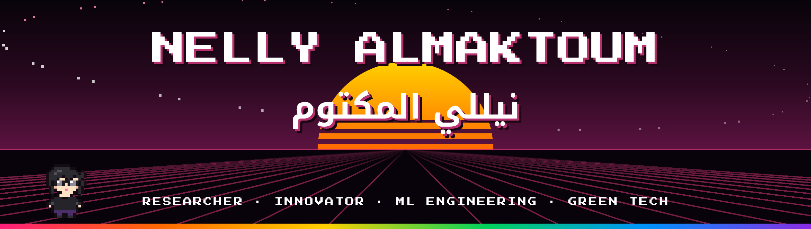

  

  <b>Undergraduate researcher merging technology with complex problems to contribute in real-world impact.</b> 
  Computer Science at King Abdulaziz University, FCIT - Waed Distinctive Excellence track, Jeddah, Saudi Arabia 
  Youngest UN-certified Saudi researcher - 6 national and international recognitions and 3 national and international awards

  
  
  
  

  
  
  

## About me

I'm a computer science student at King Abdulaziz University who loves solving problems with code and hardware, from machine learning models and full-stack web apps to [Aykah](https://github.com/nelmkt/Smart-Bin-Aykah), a solar-powered smart waste bin I designed, built and prototyped end to end.

My research connects computing with real-world systems, especially water and the environment: reproducible ML pipelines, satellite data and IoT, from measuring what urban greening really does in [Wahaj](https://github.com/nelmkt/Wahaj-Framework) to catching pipeline leaks in real time with [Maeen](https://github.com/nelmkt/maeen). I'm aiming for a Ph.D. and a career in academia. Away from the keyboard, I'm an artist.

- **Leading** the Technical Committee of the Waed Students Community at KAU
- **Focus areas:** AI/ML engineering, full-stack web development, IoT and embedded systems, remote sensing, sustainable technology
- **Portfolio** at [nelmkt.com](https://nelmkt.com): a playable retro arcade, with a professional mode one click away

## Research and projects

### [Maeen - مَعين](https://github.com/nelmkt/maeen)

Real-time detection, location and explanation of leaks and water-quality problems in water pipelines. It turns in-pipe sensor streams into decisions: what is wrong, where, how serious, why and what to do. *Maeen* is the Quranic word for flowing, pure water.

- **Accuracy:** physics-aware features plus gradient boosting reach 94.1% fault-type accuracy across 6 classes with 0.3% false alarms on unseen scenarios, against 78.5% for classic threshold rules
- **Location:** the right pair of devices 99.9% of the time, within about 110 m on a 5 km line, with a 5-minute median detection delay for leaks
- **Prototype:** complete and working, trained and stress-tested on a physics-based pipeline simulator with randomised leaks, blockages, contamination, corrosion and sensor faults
- **Engineering:** a FastAPI service with an Arabic/English dashboard, plain-language evidence for every alert, a model registry and a CI quality gate

  
  
  
  
  
  

 

### [Wahaj - وهاج](https://github.com/nelmkt/Wahaj-Framework)

A reproducible machine learning framework, in Python and Google Earth Engine, for weighing the cooling benefits of urban greening against its energy costs in desalination-dependent cities. Jeddah is the case study.

- **Model:** XGBoost land surface temperature model on Landsat 8, scored with spatial cross-validation (R² 0.795 on 19,650 cells) and benchmarked against random forest, gradient boosting and linear regression
- **Measured cooling:** a matched-contrast benchmark finds −1.18 °C per greened pixel outside the built-up area, checked against an emissivity re-retrieval, alternative NDVI thresholds and a simulation of the sensor's thermal footprint
- **Honest predictions:** counterfactual gates test whether the model's predicted greening effects hold up, and report where they do not
- **Trade-offs:** the Normalized Environmental Gain Index (NEGI), with its assumptions stated, plus a water–energy ledger: each degree of measured cooling carries about 2.9–5.3 MWh per year of desalination energy under central assumptions
- **Reproducible:** archived on Zenodo with code, Earth Engine exports, figures, tables, a reproduction guide and citation metadata

  
  
  
  
  
  
  

 

### [Aykah - آيكة](https://github.com/nelmkt/Smart-Bin-Aykah)

A patented, cost-effective, solar-powered IoT smart bin, taken from scientific research on a Sustainable Development Goal problem all the way to a working prototype and a business concept.

- **Hardware:** Raspberry Pi with ultrasonic fill sensing, an LCD interface, LED status indicators and air filtration
- **Research:** a community survey of 222 participants on waste disposal habits and acceptance of smart waste technology
- **Patent:** the system is protected by a patent
- **Recognition:** Young Researchers Award (Modern Technologies) at UNCCD COP16, and featured in the [Saudi Gazette](https://saudigazette.com.sa/article/664214/saudi-arabia/how-curiosity-led-a-saudi-teenager-to-develop-a-un-award-winning-smart-waste-management-solution)

  
  
  
  
  

 

## Recognition

| Year | Recognition | Awarded by |
| :---: | --- | --- |
| — | **Patent** for Aykah, a solar-powered IoT smart waste management system | Inventor: Nelly Almaktoum |
| 2026 | [Feature story](https://saudigazette.com.sa/article/664214/saudi-arabia/how-curiosity-led-a-saudi-teenager-to-develop-a-un-award-winning-smart-waste-management-solution) on my journey from curiosity to the award-winning Aykah smart bin | Saudi Gazette |
| 2026 | Certificate of Appreciation for distinguished participation in local and international competitions | King Abdulaziz University |
| 2026 | Academic Excellence Award 2025–2026, for a GPA of 4.5 or higher across two consecutive semesters | King Abdulaziz University |
| 2025 | IEEE Ideation Competition, 22nd International Learning and Technology Conference: presenter and team lead of five, with a top-ranked paper at the Human Machine Fusion exhibition | IEEE |
| 2024 | **Young Researchers Award, Modern Technologies.** Selected by an international panel and received at 16, making me the youngest UN-certified Saudi researcher (youngest of 209 researchers and professors from 36 countries) | United Nations Convention to Combat Desertification (UNCCD COP16) |
| 2024 | National recognition for Aykah among the selected Young Researchers at UNCCD COP16 | National Center for Meteorology (NCM) |
| 2024 | National recognition for Aykah | Ministry of Environment, Water and Agriculture (MEWA) |
| 2022 | National Mathematics Olympiad, final stage, representing the Western Region | Ministry of Education, Saudi Arabia |

**Competitions and events:** NSMO Mathematical Saudi Olympiad 2022, UNCCD COP16 (United Nations Convention to Combat Desertification) 2024, Consulting Championship 2025 (Aramco), Hackathon Al Hareeq (Ministry of Environment, Water and Agriculture, 2025), The 2nd Scientific Forum (King Abdulaziz University, 2025), IECE 2026, the International Engineering Conference and Exhibition (Saudi Council of Engineers), 2nd Conference on Sustainability and Quality of Life 2026 (King Abdulaziz University, research paper), Miyahthon 2027 (Saudi Water Authority)

## Education

| School | Programme | Years |
| --- | --- | :---: |
| **King Abdulaziz University** | BS Computer Science, FCIT - Waed Distinctive Excellence track for gifted students | 2025–2030 |
| **Dar Al Fikr Schools** | American High School Diploma - Mawhiba Alumna | 2022–2025 |

## Technical skills

**Languages**

  
  
  
  
  

**Working knowledge**

  
  
  

**ML engineering and data**

  
  
  
  
  

**Remote sensing**

  
  

**Front end**

  
  
  
  
  

**Back end**

  
  
  
  
  

**Tools**

  
  

**Hardware**

  
  
  
  
  
  
  

## Community

| Role | Where |
| --- | --- |
| **Technical Committee Lead** | Waed Students Community, King Abdulaziz University |
| **Member, Tech Department** | IEEE SB KAU, 2027 term |
| **Member, Tech Department** | Programming Club KAU, 2027 term |
| **CM Experience Member** | Google Developer Groups on Campus, KAU |
| **Organizer and Event Coordinator** | English Language Olympiad (ELO), KAU |
| **Project Coordinator, Talks X** | Engineering Day 2027 |
| **Layout & Design Specialist** | Engineering Day 2027 Planning Department |
| **Member** | Scientific Research Club, KAU |
| **Coordinator** | Annual Waed Workshop 2027 |
| **Mawhiba Alumna** | National programme for gifted students (classes 2022–2025) |

## Get in touch

I'm open to research collaboration. The fastest way to reach me is [LinkedIn](https://www.linkedin.com/in/nelmkt/) or [email](mailto:scifinel@gmail.com), and you can also find me on [X](https://x.com/nelmkt). Or press start at [nelmkt.com](https://nelmkt.com).

I speak Arabic and English.

<i>stay curious</i>

